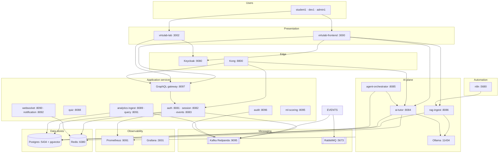
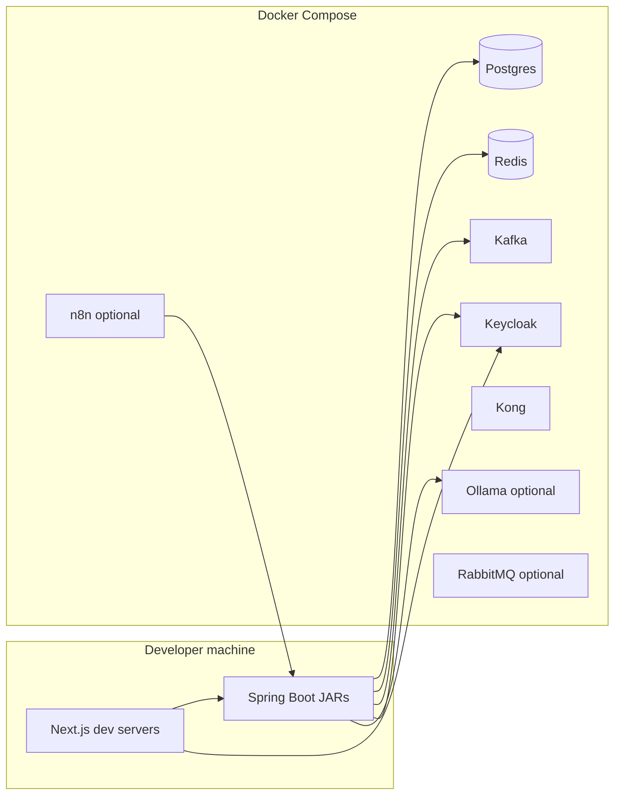
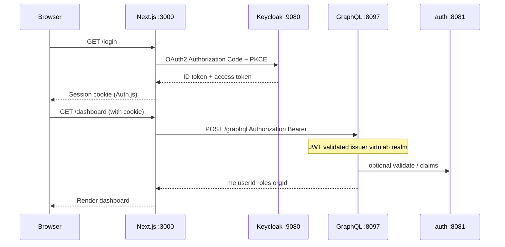
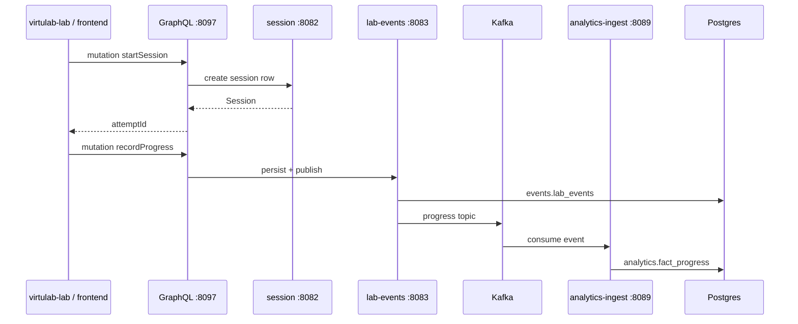
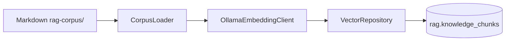
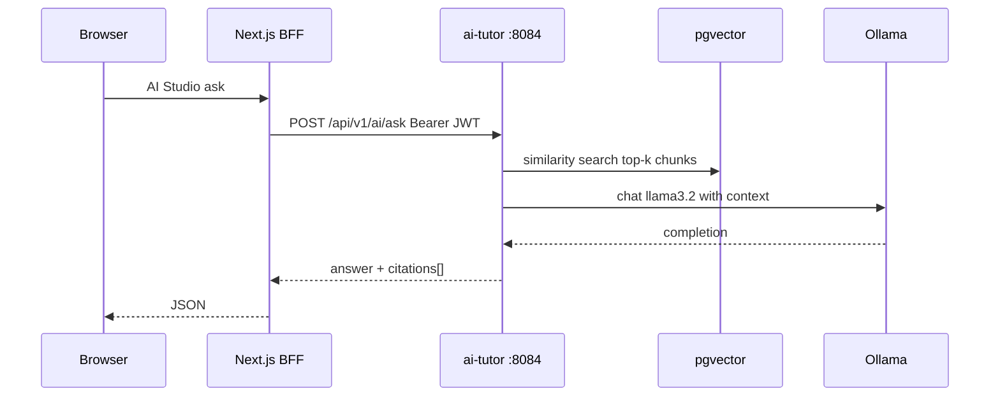
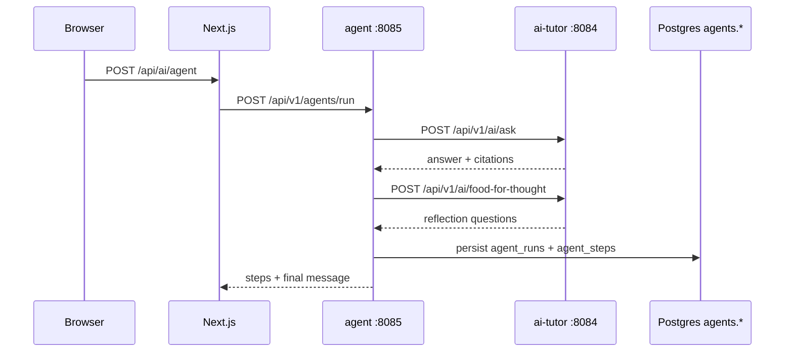
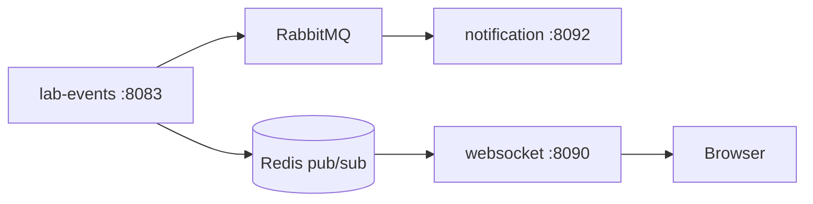
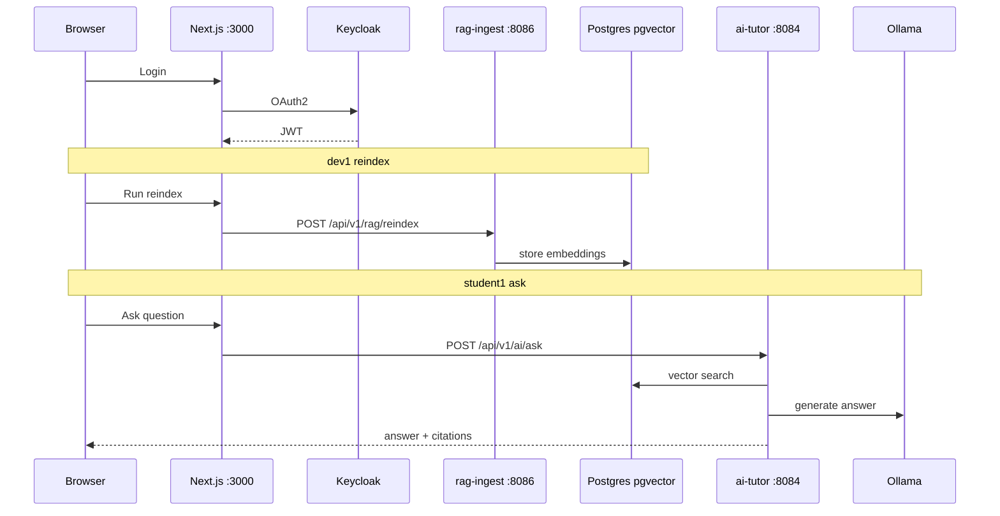

# VirtuLab — system architecture (HLD + LLD)

High-level design (HLD) explains **what** components exist and how they connect. Low-level design (LLD) explains **how** requests flow, which tables and APIs are involved, and what each service does internally.

Diagrams use [Mermaid](https://mermaid.js.org/). Paste blocks into [Mermaid Live](https://mermaid.live) to export PNG/SVG for slides.

**Related docs:** [README.md](README.md) · [GETTING_STARTED.md](GETTING_STARTED.md) · [TECHNOLOGY_STACK.md](TECHNOLOGY_STACK.md)

---

## 1. High-level design (HLD)

### 1.1 Purpose

VirtuLab is a **distributed learning platform** with:

- Browser clients (platform shell + virtual lab)
- Identity at the edge (Keycloak, optional Kong)
- Core domain microservices (auth, session, events, GraphQL)
- An **AI plane** (RAG ingest, tutor, agents) backed by Ollama and pgvector
- **Analytics** and **realtime** paths over Kafka / Redis / RabbitMQ
- **n8n** for scheduled and webhook-driven automation

### 1.2 Context diagram



### 1.3 Layered view

| Layer | Responsibility | Main technologies |
|-------|----------------|-------------------|
| **Client** | Login, dashboard, AI Studio, lab UX | Next.js, React, Auth.js |
| **Edge** | SSO, optional API gateway | Keycloak, Kong |
| **Aggregation** | Single GraphQL API for UI | Spring GraphQL, WebClient |
| **Domain** | Sessions, progress events, auth, quiz | Spring WebFlux, JDBC |
| **AI** | Ingest, retrieve, generate, orchestrate | Ollama, pgvector, Resilience4j |
| **Analytics** | Stream ingest + SQL reports | Kafka consumers, Postgres star schema |
| **Realtime** | Live progress fan-out | WebSocket, Redis pub/sub, RabbitMQ |
| **Automation** | Cron / webhooks | n8n |
| **Data** | Persistence, cache, vectors | Postgres, Redis |
| **Messaging** | Async integration | Kafka, RabbitMQ |

### 1.4 Deployment view (development)



Production-oriented assets: `virtulab-platform/deploy/k8s/`, `.github/workflows/docker-publish.yml`.

### 1.5 Kafka vs RabbitMQ (design choice)

| | Kafka (Redpanda) | RabbitMQ |
|---|------------------|----------|
| **Pattern** | Durable log, many consumers, replay | Queues, work distribution, ACK |
| **VirtuLab use** | Lab progress → analytics ingest; AI events; audit | Notifications, async jobs |
| **Analogy** | Recorded event stream | To-do tray per worker |

---

## 2. Low-level design (LLD)

### 2.1 Authentication and session (login → API call)



| Step | Detail |
|------|--------|
| Client | Public OIDC client `virtulab-web` in realm `virtulab` |
| Token | JWT access token; resource servers use `issuer-uri` |
| Frontend env | `AUTH_SECRET`, `AUTH_KEYCLOAK_*` in `.env.local` |
| Roles | `student`, `instructor`, `admin` (demo users in realm JSON) |

**auth-service** (`8081`):

| Method | Path | Purpose |
|--------|------|---------|
| POST | `/api/v1/auth/validate` | Validate Keycloak token |
| POST | `/api/v1/auth/token` | Issue platform JWT where needed |

---

### 2.2 Lab session and progress (GraphQL → events → analytics)



**GraphQL schema** (`graphql-gateway-service`):

```graphql
type Query {
  me: Me!
  session(attemptId: ID!): Session
}
type Mutation {
  startSession(input: StartSessionInput!): Session!
  recordProgress(input: ProgressInput!): ProgressAck!
}
```

Gateway delegates to **session-service** and **lab-events-service** via WebClient (reactive).

**session schema** (`session.lab_sessions`):

| Column | Type | Notes |
|--------|------|-------|
| id | UUID | PK |
| attempt_id | VARCHAR | Unique per lab run |
| experiment_id | VARCHAR | e.g. `v1-chemistry` |
| user_id, tenant_id, org_id | VARCHAR | Multi-tenant keys |
| mode, lang | VARCHAR | `practice` / `exam`, locale |

**events schema** (`events.lab_events`):

| Column | Type | Notes |
|--------|------|-------|
| progress_json | JSONB | Step state from lab UI |
| step_id | VARCHAR | Lab step identifier |
| event_type | VARCHAR | Default `PROGRESS` |

**analytics star schema** (ingested from Kafka):

- `analytics.dim_org`, `analytics.dim_user`
- `analytics.fact_progress` — one row per progress event (dedup by `event_id`)
- `analytics.fact_ai` — tutor/agent usage

**analytics-query-service** (`8091`) serves read APIs / JDBC reports for dashboards.

---

### 2.3 RAG ingest (corpus → embeddings → pgvector)



**Trigger:** `POST /api/v1/rag/reindex` (role: instructor/admin) or n8n workflow N3.

**Algorithm (ReindexService):**

1. Create job id → status `RUNNING`
2. `nextCorpusVersion()` → new version integer
3. For each file from `CORPUS_PATH` (default `rag-corpus/`):
   - Parse YAML front matter (`experimentId`, `lang`, `docType`)
   - Chunk content
   - Call Ollama `nomic-embed-text` → `float[768]`
   - `INSERT` into `rag.knowledge_chunks`
4. `activateVersion(version)` — flip active corpus pointer
5. Job status → `COMPLETED` or `FAILED`

**Postgres (Phase 4 init):**

```sql
-- rag.corpus_version (version, active)
-- rag.knowledge_chunks (id, content, embedding vector(768), metadata JSONB, corpus_version)
```

Indexes: `corpus_version`, `metadata->>'experimentId'`.

**REST — rag-ingest-service** (`8086`):

| Method | Path | Purpose |
|--------|------|---------|
| POST | `/api/v1/rag/reindex` | Start async reindex job |
| GET | `/api/v1/rag/jobs/{jobId}` | Poll job status |
| GET | `/api/v1/rag/stats` | Chunk counts / active version |

**Optional:** Temporal workflow (`TEMPORAL_ENABLED=true`) for durable reindex — see `deploy/docker-compose.temporal.yml`.

---

### 2.4 AI tutor ask (RAG retrieval + LLM)



**REST — ai-tutor-service** (`8084`):

| Method | Path | Purpose |
|--------|------|---------|
| POST | `/api/v1/ai/ask` | RAG-grounded Q&A |
| POST | `/api/v1/ai/food-for-thought` | Reflection prompts (lighter RAG) |

**Config** (`application.yml`):

- `OLLAMA_EMBED_MODEL`: `nomic-embed-text`
- `OLLAMA_CHAT_MODEL`: `llama3.2`
- `embedding-dimensions`: 768
- Resilience4j circuit breaker on Ollama client

**Frontend proxy:** `virtulab-frontend/src/app/api/ai/*` forwards to `RAG_URL`, `AI_URL`, `AGENT_URL` with session access token.

---

### 2.5 Agent orchestration (multi-step)



**Agent types** (`agent-orchestrator-service`):

| agentType | Behavior |
|-----------|----------|
| `postExperimentTutor` | RAG ask → food-for-thought → combined response |
| `quizExplainer` | Explain quiz concept via tutor APIs |

**Postgres:**

- `agents.agent_runs` — run metadata, input/output JSON
- `agents.agent_steps` — per-step tool name, I/O, LLM messages

---

### 2.6 Realtime and notifications (Phase 6)



- **WebSocket:** `ws://localhost:8090/api/v1/ws/live?token=<JWT>`
- **RabbitMQ:** management UI http://localhost:15673

---

### 2.7 n8n automation (Phase 7)

| Workflow | Trigger | Typical action |
|----------|---------|----------------|
| N1 | Cron daily 06:00 | Org report |
| N2 | Webhook `/webhook/dlq-alert` | Alert on DLQ |
| N3 | Cron weekly | Call RAG reindex |
| N4 | Webhook `/webhook/progress-live` | Forward progress |
| N6 | Webhook `/webhook/cb-open` | Circuit breaker opened |

JSON definitions: `virtulab-platform/virtulab-n8n/workflows/`.  
Kong consumer `virtulab-internal` + API key for n8n → backend (see `deploy/kong/kong.yml`).

---

### 2.8 Kong routing (optional edge)

Kong (`8800`) proxies to **host.docker.internal** JAR ports in dev:

| Path prefix | Backend |
|-------------|---------|
| `/api/v1/auth` | auth :8081 |
| `/api/v1/sessions` | session :8082 |
| `/api/v1/events` | lab-events :8083 |
| `/graphql` | graphql :8097 |
| `/api/v1/ai` | ai-tutor :8084 |
| `/api/v1/agents` | agent :8085 |
| `/api/v1/rag` | rag-ingest :8086 |

Frontend `.env` can use `GRAPHQL_URL=http://localhost:8097/graphql` or Kong `http://localhost:8800/graphql`.

---

### 2.9 Service catalog (LLD summary)

| Service | Port | Schema / topic | Key dependencies |
|---------|------|----------------|------------------|
| auth-service | 8081 | — | Redis, Keycloak |
| session-service | 8082 | `session.*` | Postgres, Redis |
| lab-events-service | 8083 | `events.*` | Postgres, Kafka, RabbitMQ, Redis |
| ai-tutor-service | 8084 | rag vectors | Postgres, Ollama, Redis, Kafka |
| agent-orchestrator-service | 8085 | `agents.*` | Postgres, ai-tutor HTTP |
| rag-ingest-service | 8086 | `rag.*` | Postgres, Ollama, Temporal optional |
| quiz-service | 8088 | quiz tables | Postgres |
| analytics-ingest-service | 8089 | `analytics.*` | Postgres, Kafka |
| websocket-gateway-service | 8090 | — | Redis |
| analytics-query-service | 8091 | `analytics.*` | Postgres, Redis |
| notification-service | 8092 | — | RabbitMQ |
| ml-scoring-service | 8095 | ML tables | Postgres, analytics facts |
| audit-service | 8096 | audit events | Kafka |
| graphql-gateway-service | 8097 | — | auth, session, events HTTP |

---

### 2.10 Shared module and cross-cutting concerns

| Concern | Implementation |
|---------|----------------|
| DTOs / JWT helpers | `virtulab-platform/contracts` |
| Security | Spring OAuth2 Resource Server per service |
| Migrations | Flyway `db/migration/V*.sql` per service |
| Metrics | Actuator `/actuator/prometheus`, `/actuator/health` |
| Build | Maven reactor `./scripts/build.sh` |

---

### 2.11 Frontend module map

| App | Port | Routes (examples) |
|-----|------|-------------------|
| virtulab-frontend | 3000 | `/login`, `/dashboard`, `/ai-studio`, `/lab` |
| virtulab-lab | 3002 | Lab steps UI (content from local `content/`) |

**BFF API routes** (server-side, hold secrets):

- `/api/ai/reindex` → rag-ingest
- `/api/ai/ask`, agent proxies → ai-tutor / agent-orchestrator

---

### 2.12 Phase rollout map (implementation order)

| Phase | Capability | Scripts / compose |
|-------|------------|-------------------|
| 1–2 | Postgres, Redis, Kafka, Kong, Keycloak, core + GraphQL | `docker-compose.yml`, `run-all.sh` |
| 3 | Prometheus, Grafana | `docker-compose.phase3.yml` |
| 4 | pgvector, RAG, tutor, agent, Ollama | `init-phase4-db.sh`, `run-phase4.sh` |
| 5 | Analytics ingest/query | `run-phase5.sh` |
| 6 | RabbitMQ, WebSocket, notifications | `run-phase6.sh` |
| 7 | n8n | `run-phase7.sh` |
| 8 | Audit, MCP servers | `run-phase8.sh` |
| 9 | ML scoring | `run-phase9.sh` |
| 10 | Lab app integration | `run-phase10.sh`, virtulab-lab |
| 11 | JMeter load tests | `virtulab-load-tests/` |
| 12 | Docker images, K8s, CI | `deploy/k8s/`, GitHub Actions |

Detailed run steps: [GETTING_STARTED.md](GETTING_STARTED.md).

---

## 3. AI Studio demo flow (end-to-end)



---

## 4. Port reference (quick)

| Component | Port |
|-----------|------|
| virtulab-frontend | 3000 |
| virtulab-lab | 3002 |
| Grafana | 3001 |
| auth | 8081 |
| session | 8082 |
| lab-events | 8083 |
| ai-tutor | 8084 |
| agent | 8085 |
| rag-ingest | 8086 |
| quiz | 8088 |
| analytics-ingest | 8089 |
| websocket | 8090 |
| analytics-query | 8091 |
| notification | 8092 |
| ml-scoring | 8095 |
| audit | 8096 |
| graphql | 8097 |
| Postgres | 5434 |
| Redis | 6380 |
| Kafka | 9095 |
| Kong proxy | 8800 |
| Keycloak | 9080 |
| Ollama | 11434 |
| RabbitMQ | 5673 / UI 15673 |
| n8n | 5680 |
| Prometheus | 9091 |
