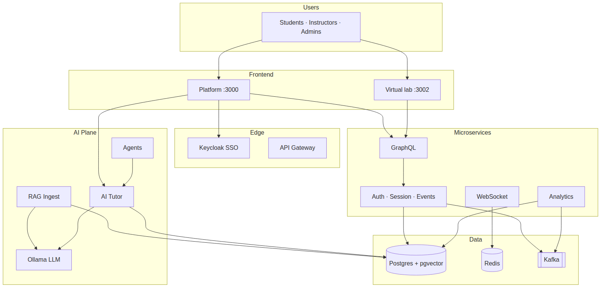
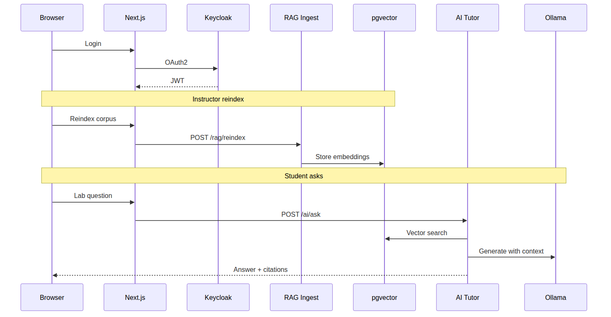
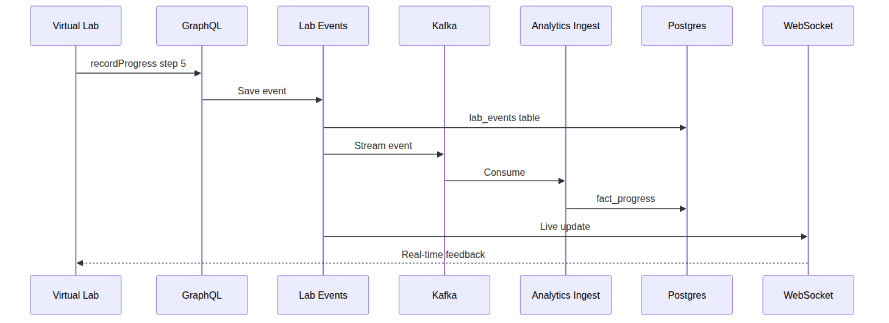
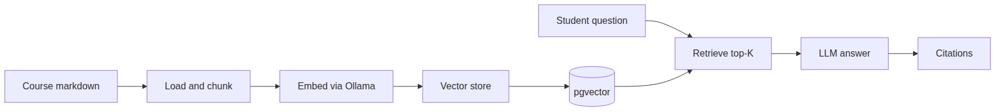
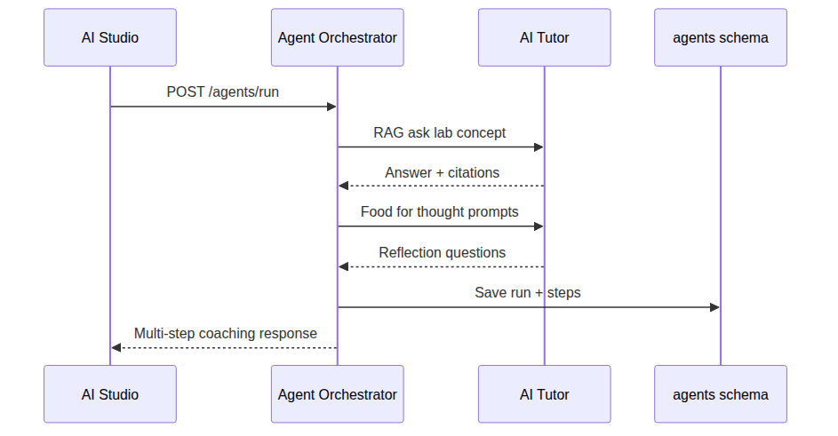

# LinkedIn carousel — complete deck (10 slides)

Build a **LinkedIn document carousel** or **PDF** from this pack. Pair with the main post in [LINKEDIN_POST.md](LINKEDIN_POST.md).

**Repo:** https://github.com/dseevs/Rag-GenAI-n8n-AgenticAI

---

## Quick build (3 steps)

```bash
cd linkedin-carousel
chmod +x export-diagrams.sh
./export-diagrams.sh          # → exported/*.png
```

Then for each slide `01`–`10`:

1. Open `slides/NN-*.md` for **headline + bullets**
2. Drop matching PNG from `exported/` (slides 3–7)
3. Export slide as **1080×1080** (square) or **1920×1080** (document)

**Tools:** Canva · PowerPoint · Google Slides · Figma · LinkedIn native “Add document”

---

## Slide map

| # | File | Visual asset |
|---|------|----------------|
| 1 | [slides/01-cover.md](linkedin-carousel/slides/01-cover.md) | Text only + QR |
| 2 | [slides/02-agentic-rag-education.md](linkedin-carousel/slides/02-agentic-rag-education.md) | Text |
| 3 | [slides/03-hld.md](linkedin-carousel/slides/03-hld.md) | `exported/03-hld-context.png` |
| 4 | [slides/04-student-journey.md](linkedin-carousel/slides/04-student-journey.md) | `exported/04-ai-studio-flow.png` |
| 5 | [slides/05-live-analytics.md](linkedin-carousel/slides/05-live-analytics.md) | `exported/05-lab-analytics.png` |
| 6 | [slides/06-rag-lld.md](linkedin-carousel/slides/06-rag-lld.md) | `exported/06-rag-pipeline.png` |
| 7 | [slides/07-agents-lld.md](linkedin-carousel/slides/07-agents-lld.md) | `exported/07-agent-flow.png` |
| 8 | [slides/08-tech-stack.md](linkedin-carousel/slides/08-tech-stack.md) | Table (text) |
| 9 | [slides/09-kafka-rabbitmq.md](linkedin-carousel/slides/09-kafka-rabbitmq.md) | Table (text) |
| 10 | [slides/10-cta.md](linkedin-carousel/slides/10-cta.md) | GitHub + Sandeep & Tushar |

---

## Slide 1 — Cover

```
Will AI replace us—
or create cooler opportunities?

VirtuLab
RAG · GenAI · Agentic AI · n8n · Microservices

github.com/dseevs/Rag-GenAI-n8n-AgenticAI
```

---

## Slide 2 — Agentic RAG in education

**Headline:** Agentic RAG transforms education

- **Grounded answers** — cites your lab guide, not the whole internet  
- **Agents** — post-lab reflection, quiz help, multi-step coaching  
- **Live learning data** — Kafka events, not only marketing pixels  

**Example:**  
*"You spent 4 min on titration—review meniscus reading in Lab Guide §3."*

---

## Slide 3 — HLD

**Headline:** High-level design — full system context



*If image missing, run `./export-diagrams.sh` or paste `diagrams/03-hld-context.mmd` into [Mermaid Live](https://mermaid.live).*

---

## Slide 4 — Student journey (LLD)

**Headline:** Login → Reindex → Ask → Citations



---

## Slide 5 — Live analytics (not GA)

**Headline:** Learning analytics ≠ Google Analytics

| Google Analytics | VirtuLab |
|------------------|----------|
| Page views | Lab **step** events |
| Marketing | **Instructors** |
| Delayed | **Kafka + WebSocket** |



---

## Slide 6 — RAG pipeline (LLD)

**Headline:** How RAG works

Markdown → chunk → embed (Ollama) → **pgvector** → retrieve → LLM → **citations**



---

## Slide 7 — Agents (LLD)

**Headline:** Agent orchestrator

Multi-step: RAG ask → food-for-thought → saved steps in Postgres



---

## Slide 8 — Tech stack

| Layer | Stack |
|-------|--------|
| Frontend | Next.js 16 · React 19 · TypeScript · Tailwind · Auth.js |
| Backend | Spring Boot 3.3 · WebFlux · 14 microservices |
| Data | PostgreSQL · pgvector · Redis |
| Messaging | Kafka · RabbitMQ |
| AI | Ollama · RAG · Tutor · Agents |
| Automation | n8n |
| Ops | Prometheus · Grafana · JMeter · Docker · K8s |

Details: `TECHNOLOGY_STACK.md`

---

## Slide 9 — Kafka vs RabbitMQ + n8n

| | Kafka | RabbitMQ |
|---|-------|----------|
| Use | Progress → analytics, AI events | Notifications, jobs |
| Model | Event stream | Task queue |

**n8n:** weekly RAG reindex · DLQ alerts · progress webhooks

---

## Slide 10 — CTA + contributors

**Explore the repo**  
https://github.com/dseevs/Rag-GenAI-n8n-AgenticAI

- `ARCHITECTURE.md` — HLD + LLD  
- `GETTING_STARTED.md` — run locally  
- `TECHNOLOGY_STACK.md` — learn every tool  

**Thank you**  
**Sandeep** · **Tushar** — architecture & implementation  

⭐ Star the repo  
💬 *Would you trust AI more with citations from your course?*

---

## Mermaid source files

| Diagram | File |
|---------|------|
| HLD context | [diagrams/03-hld-context.mmd](linkedin-carousel/diagrams/03-hld-context.mmd) |
| AI Studio | [diagrams/04-ai-studio-flow.mmd](linkedin-carousel/diagrams/04-ai-studio-flow.mmd) |
| Lab analytics | [diagrams/05-lab-analytics.mmd](linkedin-carousel/diagrams/05-lab-analytics.mmd) |
| RAG pipeline | [diagrams/06-rag-pipeline.mmd](linkedin-carousel/diagrams/06-rag-pipeline.mmd) |
| Agents | [diagrams/07-agent-flow.mmd](linkedin-carousel/diagrams/07-agent-flow.mmd) |
| GA vs learning | [diagrams/08-ga-vs-learning.mmd](linkedin-carousel/diagrams/08-ga-vs-learning.mmd) |

---

## LinkedIn upload checklist

- [ ] Run `linkedin-carousel/export-diagrams.sh`
- [ ] Build 10 slides in Canva/PPT (1080×1080 recommended)
- [ ] Export PDF or upload images as carousel
- [ ] Post [LINKEDIN_POST.md](LINKEDIN_POST.md) Version A as text
- [ ] Attach carousel/PDF to same post
- [ ] First comment with doc links
- [ ] Tag **Sandeep** and **Tushar**
- [ ] Poll next day (see LINKEDIN_POST.md)

---

## PDF one-liner (if you have pandoc + wkhtmltopdf)

```bash
# Optional: combine slide markdown into one PDF (text-only; add images manually in Word/Canva)
pandoc linkedin-carousel/slides/*.md -o VirtuLab-LinkedIn-Carousel.pdf 2>/dev/null || echo "Install pandoc for PDF merge"
```

Recommended: **Canva** “Carousel” template → paste each slide section → insert PNGs from `exported/`.
