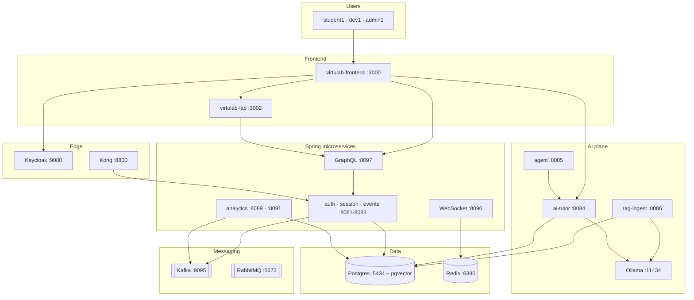

# Rag-GenAI-n8n-AgenticAI

[](https://github.com/dseevs/Rag-GenAI-n8n-AgenticAI)

**VirtuLab** — a full-stack learning platform that combines virtual chemistry labs, retrieval-augmented tutoring (RAG), multi-agent orchestration, workflow automation (n8n), and real-time analytics. Built as a microservices monorepo suitable for portfolio demos, research prototypes, and incremental production hardening.

> **Note:** Curriculum markdown (`rag-corpus/`), lab scenario content (`virtulab-lab/content/`), and internal runbooks (`virtulab-platform/docs/`) are **intentionally excluded** from this public repository. See [`local-setup/README.md`](local-setup/README.md) for what you must add on your machine.

---

## Documentation index

| Document | Contents |
|----------|----------|
| **[GETTING_STARTED.md](GETTING_STARTED.md)** | Install, run core or full stack, ports, demo users, troubleshooting |
| **[ARCHITECTURE.md](ARCHITECTURE.md)** | **High-level design (HLD)** + **low-level design (LLD)** — diagrams, APIs, schemas, flows |
| **[TECHNOLOGY_STACK.md](TECHNOLOGY_STACK.md)** | Every technology explained — what it is and what concept it teaches |
| **[GITHUB_SETUP.md](GITHUB_SETUP.md)** | Clone, SSH/PAT, push, security checklist |
| **[local-setup/README.md](local-setup/README.md)** | Private corpus, lab content, secrets |

---

## Theory & design goals

Modern STEM education needs more than static PDFs: learners should **practice in a safe virtual lab**, get **grounded AI help** tied to course material, and let instructors see **progress signals** without compromising privacy.

This project explores four ideas together:

| Pillar | Role in VirtuLab |
|--------|------------------|
| **RAG (Retrieval-Augmented Generation)** | Ingest course/lab markdown, chunk and embed into Postgres **pgvector**, retrieve citations before the tutor answers — reducing hallucinations on factual lab procedures. |
| **GenAI / tutoring** | `ai-tutor-service` calls a local or remote LLM (e.g. Ollama) with retrieved context; the frontend **AI Studio** exposes ask/reindex flows. |
| **Agentic AI** | `agent-orchestrator-service` coordinates tool-using agents (quiz hints, post-lab reflection, multi-step reasoning) over the same knowledge base and platform APIs. |
| **n8n automation** | Scheduled RAG reindex, DLQ alerts, progress webhooks, and circuit-breaker notifications — ops glue without hard-coding every integration in Java. |

**Supporting capabilities** include **Keycloak** SSO, **Kong** API gateway, **Kafka** event streaming, **WebSockets** for live progress, **Temporal** (optional) for durable reindex workflows, **Prometheus/Grafana** observability, **MCP** sample servers, and **JMeter** smoke/load scripts in `virtulab-load-tests/`.

The repo is intentionally **broad**: many industry tools appear in one system so you can study **integration patterns**, not only a single framework in isolation.

---

## Architecture

### High-level (system context)



### Low-level design (LLD)

For **sequence diagrams**, **REST/GraphQL contracts**, **database schemas** (`session`, `events`, `rag`, `agents`, `analytics`), **RAG pipeline steps**, **agent orchestration**, **Kong routes**, and **per-service ports**, see:

**[ARCHITECTURE.md](ARCHITECTURE.md)** — full HLD + LLD reference.

---

## Monorepo layout

| Directory | Description |
|-----------|-------------|
| [`virtulab-platform/`](virtulab-platform/) | Spring Boot microservices, Docker Compose stacks, n8n workflow JSON, MCP servers, ML scoring scripts |
| [`virtulab-frontend/`](virtulab-frontend/) | Next.js platform shell — login, dashboard, AI Studio, lab host |
| [`virtulab-lab/`](virtulab-lab/) | Next.js virtual lab UI (content paths are local-only) |
| [`virtulab-load-tests/`](virtulab-load-tests/) | JMeter plans and `run-smoke.sh` |
| [`local-setup/`](local-setup/) | Checklist of private assets you must supply |

```
AgenticAi/
├── virtulab-platform/       # Backend + deploy + n8n + MCP
├── virtulab-frontend/       # :3000
├── virtulab-lab/            # :3002
├── virtulab-load-tests/
├── README.md                # This file
├── ARCHITECTURE.md          # HLD + LLD
├── GETTING_STARTED.md
├── TECHNOLOGY_STACK.md
└── GITHUB_SETUP.md
```

---

## Prerequisites

| Software | Version | Used for |
|----------|---------|----------|
| **Java** | 17+ | Spring Boot microservices |
| **Maven** | 3.9+ | Build all backend JARs |
| **Node.js** | 20+ | Frontend and lab apps |
| **Docker** + Compose | recent | Postgres, Redis, Kafka, Keycloak, Kong, optional Ollama/n8n |
| **Git** | any | Clone repository |
| **Ollama** (optional) | recent | Local LLM if not using Docker Ollama overlay |
| **JMeter** (optional) | 5.x | Load tests in `virtulab-load-tests/` |

**Hardware:** 8 GB RAM minimum; **16 GB recommended** when running Docker + Ollama + many JARs.

---

## Quick start (development)

### 1. Clone and add private assets

```bash
git clone git@github.com:dseevs/Rag-GenAI-n8n-AgenticAI.git
cd Rag-GenAI-n8n-AgenticAI
```

Create ignored folders per [`local-setup/README.md`](local-setup/README.md) (corpus, lab content, secrets).  
[GETTING_STARTED.md](GETTING_STARTED.md) includes a **minimal sample RAG file** you can paste in minutes.

### 2. Start infrastructure

```bash
cd virtulab-platform/deploy
docker compose up -d
docker compose ps
```

### 3. Build & run backend (Java 17+)

```bash
cd virtulab-platform
./scripts/build.sh
./scripts/run-all.sh    # auth, session, events, graphql — keep terminal open
```

### 4. Frontend

```bash
cd virtulab-frontend
cp .env.example .env.local
# AUTH_SECRET: openssl rand -base64 32
npm install
npm run dev
```

Open **http://localhost:3000** → Sign in → Keycloak (`student1` / `password`).

### 5. RAG & AI (after corpus exists locally)

```bash
cd virtulab-platform
./scripts/init-phase4-db.sh
ollama pull nomic-embed-text && ollama pull llama3.2
./scripts/run-phase4.sh
```

Use **AI Studio** or `POST /api/v1/rag/reindex` — see [ARCHITECTURE.md §2.3–2.5](ARCHITECTURE.md).

### 6. Optional phases

| Phase | Command | Capability |
|-------|---------|------------|
| 5 | `./scripts/run-phase5.sh` | Analytics ingest + query |
| 6 | `./scripts/run-phase6.sh` | RabbitMQ, WebSocket, notifications |
| 7 | `./scripts/run-phase7.sh` | n8n http://localhost:5680 |
| 8 | `./scripts/run-phase8.sh` | Audit + MCP servers |
| 9 | `./scripts/run-phase9.sh` | ML scoring |
| 10 | `virtulab-lab` `npm run dev` | Virtual lab :3002 |
| 3 | `./scripts/run-phase3.sh` | Prometheus :9091, Grafana :3001 |
| 11 | `virtulab-load-tests/run-smoke.sh` | JMeter smoke |

Full paths and port tables: **[GETTING_STARTED.md](GETTING_STARTED.md)**.

---

## What you must add yourself (not in this repo)

| Item | Why omitted |
|------|-------------|
| `virtulab-platform/rag-corpus/**` | Proprietary / course-specific training text |
| `virtulab-lab/content/**` | Lab scenario definitions tied to your curriculum |
| `virtulab-platform/docs/**` | Internal phase runbooks, demo scripts, detailed test plans |
| Production secrets | `JWT_SECRET`, DB passwords, Keycloak client secrets, webhook tokens |
| Cloud LLM keys | If not using local Ollama |

Placeholder structure and front-matter examples: [`local-setup/README.md`](local-setup/README.md).

---

## Demo users (development only)

| User | Password | Typical use |
|------|----------|-------------|
| `student1` | `password` | Student — dashboard, AI ask |
| `dev1` | `password` | Developer — RAG reindex |
| `admin1` | `password` | Admin |

Keycloak admin console: http://localhost:9080 (`admin` / `admin`).

---

## Technology overview

| Area | Stack |
|------|--------|
| Frontend | Next.js 16, React 19, TypeScript, Tailwind 4, Auth.js, Redux Saga |
| Backend | Spring Boot 3.3, WebFlux, Maven, Flyway |
| Identity | Keycloak OIDC, JWT resource servers |
| Data | PostgreSQL 16, pgvector, Redis 7 |
| Messaging | Redpanda (Kafka API), RabbitMQ |
| AI | Ollama, RAG, agent orchestrator |
| Automation | n8n |
| Observability | Prometheus, Grafana, Micrometer |
| Delivery | Docker Compose, Kubernetes manifests, GitHub Actions |

**Explain every technology in depth:** **[TECHNOLOGY_STACK.md](TECHNOLOGY_STACK.md)**

---

## Push to GitHub

**[GITHUB_SETUP.md](GITHUB_SETUP.md)** — SSH keys, PAT, Cursor askpass fix, pre-push checklist.

```bash
git add .
git commit -m "your message"
git push
```

---

## Security

- Rotate all default passwords (`virtulab`, dev JWT secrets) before any shared deployment.  
- Use environment variables or a secret manager in production; never commit real credentials.  
- Treat the AI plane as **untrusted input** — validate tool calls and scope agent permissions per tenant.

---

## License

Add your chosen license file before publishing if you intend open-source distribution.

---

## Author

Maintained by **[dseevs](https://github.com/dseevs)** — portfolio / research codebase for RAG, generative AI tutoring, n8n automation, and agentic orchestration on a microservices learning platform.

**Live repo:** https://github.com/dseevs/Rag-GenAI-n8n-AgenticAI
