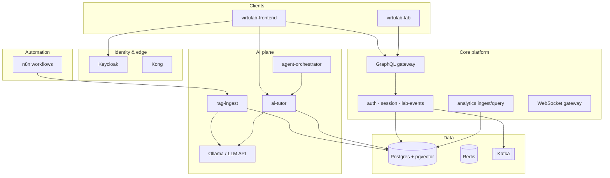

# Rag-GenAI-n8n-AgenticAI

**VirtuLab** — a full-stack learning platform that combines virtual chemistry labs, retrieval-augmented tutoring (RAG), multi-agent orchestration, workflow automation (n8n), and real-time analytics. Built as a microservices monorepo suitable for portfolio demos, research prototypes, and incremental production hardening.

> **Note:** Curriculum markdown (`rag-corpus/`), lab scenario content (`virtulab-lab/content/`), and internal runbooks (`docs/`) are **intentionally excluded** from this public repository. See [`local-setup/README.md`](local-setup/README.md) for what you must add on your machine.

---

## Theory & design goals

Modern STEM education needs more than static PDFs: learners should **practice in a safe virtual lab**, get **grounded AI help** tied to course material, and let instructors see **progress signals** without compromising privacy.

This project explores four ideas together:

| Pillar | Role in VirtuLab |
|--------|------------------|
| **RAG (Retrieval-Augmented Generation)** | Ingest course/lab markdown, chunk and embed into Postgres **pgvector**, retrieve citations before the tutor answers — reducing hallucinations on factual lab procedures. |
| **GenAI / tutoring** | `ai-tutor-service` calls a local or remote LLM (e.g. Ollama) with retrieved context; the frontend **AI Studio** exposes ask/reindex flows. |
| **Agentic AI** | `agent-orchestrator-service` coordinates tool-using agents (quiz hints, safety checks, multi-step reasoning) over the same knowledge base and platform APIs. |
| **n8n automation** | Scheduled RAG reindex, DLQ alerts, progress webhooks, and circuit-breaker notifications — ops glue without hard-coding every integration in Java. |

Supporting capabilities include **Keycloak** SSO, **Kong** API gateway, **Kafka** event streaming, **WebSockets** for live progress, **Temporal** (optional) for durable reindex workflows, **Prometheus/Grafana** observability, and **JMeter** smoke/load scripts in `virtulab-load-tests/`.

### High-level architecture



### Monorepo layout

| Directory | Description |
|-----------|-------------|
| [`virtulab-platform/`](virtulab-platform/) | Spring Boot microservices, Docker Compose stacks, n8n workflow JSON, MCP servers, ML scoring scripts |
| [`virtulab-frontend/`](virtulab-frontend/) | Next.js platform shell — login, dashboard, AI Studio, lab host |
| [`virtulab-lab/`](virtulab-lab/) | Next.js virtual lab UI (content paths are local-only) |
| [`virtulab-load-tests/`](virtulab-load-tests/) | JMeter plans and `run-smoke.sh` |
| [`local-setup/`](local-setup/) | Checklist of private assets you must supply |

---

## Prerequisites

- **Java 17+** and **Maven 3.9+**
- **Node.js 20+** and npm
- **Docker** and Docker Compose
- **Git**
- Optional: **Ollama** for local LLM inference
- Optional: **JMeter** for load tests

---

## Quick start (development)

### 1. Clone and add private assets

```bash
git clone https://github.com/dseevs/Rag-GenAI-n8n-AgenticAI.git
cd Rag-GenAI-n8n-AgenticAI
```

Create ignored folders per [`local-setup/README.md`](local-setup/README.md) (corpus, lab content, secrets).

### 2. Start infrastructure

```bash
cd virtulab-platform/deploy
docker compose up -d
```

### 3. Build backend

```bash
cd virtulab-platform
./scripts/build.sh
./scripts/run-all.sh   # or run individual scripts/run-*.sh
```

### 4. Frontend

```bash
cd virtulab-frontend
cp .env.example .env.local
# Set AUTH_SECRET: openssl rand -base64 32
npm install
npm run dev
```

Open **http://localhost:3000** — default Keycloak users are documented in platform deploy/Keycloak realm (e.g. `student1` / `password` in dev).

### 5. RAG & AI (after corpus exists locally)

Initialize Phase 4 database extensions, start RAG/tutor/agent services, then ingest your local `rag-corpus/` (see platform scripts `init-phase4-db.sh`, `run-phase4.sh`).

### 6. n8n (optional)

```bash
cd virtulab-platform
./scripts/run-phase7.sh
```

Import JSON from `virtulab-platform/virtulab-n8n/workflows/` and configure credentials in the n8n UI.

---

## What you must add yourself (not in this repo)

| Item | Why omitted |
|------|-------------|
| `virtulab-platform/rag-corpus/**` | Proprietary / course-specific training text |
| `virtulab-lab/content/**` | Lab scenario definitions tied to your curriculum |
| `virtulab-platform/docs/**` | Internal phase runbooks, demo scripts, detailed test plans |
| Production secrets | `JWT_SECRET`, DB passwords, Keycloak client secrets, webhook tokens |
| Cloud LLM keys | If not using local Ollama |

Placeholder structure and front-matter examples: [`local-setup/README.md`](local-setup/README.md).

---

## Push this codebase to GitHub

Run these commands **from the repository root** (`AgenticAi/` or your renamed clone folder). Do this once per machine.

### A. One-time: GitHub repository

1. Create an empty repo on GitHub: **https://github.com/new**  
   - Name: `Rag-GenAI-n8n-AgenticAI`  
   - Do **not** add a README, `.gitignore`, or license (this repo already has them).

2. Authenticate (choose one):
   - **HTTPS + PAT:** GitHub → Settings → Developer settings → Personal access tokens → generate `repo` scope.  
   - **SSH:** Add your public key under GitHub → Settings → SSH keys, then use `git@github.com:dseevs/Rag-GenAI-n8n-AgenticAI.git`.

### B. Initialize and push (local)

```bash
cd /path/to/Rag-GenAI-n8n-AgenticAI   # your workspace root

# Verify ignored private folders are NOT listed
git status

git init
git add .
git status   # confirm: no docs/, rag-corpus/, .env.local, .metadata/, *.plan.md

git commit -m "Initial commit: VirtuLab RAG, GenAI, n8n, and agentic platform"

git branch -M main
git remote add origin https://github.com/dseevs/Rag-GenAI-n8n-AgenticAI.git
# Or SSH: git remote add origin git@github.com:dseevs/Rag-GenAI-n8n-AgenticAI.git

git push -u origin main
```

### C. Before every push — safety checklist

```bash
git status
git diff --cached
```

Confirm you are **not** committing:

- `.env`, `.env.local`, or real `deploy/k8s/secret.yaml` values  
- `rag-corpus/`, `virtulab-lab/content/`, `docs/`  
- `VIRTULAB_MASTER_LEARNING_PLATFORM_PLAN.md` or `*.plan.md`  
- `.metadata/`, `node_modules/`, `target/`, `.next/`  
- `.cursor/` or agent transcript folders  

If something sensitive was staged by mistake:

```bash
git reset HEAD <file>
echo "<pattern>" >> .gitignore
git add .gitignore && git commit -m "chore: extend gitignore"
```

### D. If the remote already has a README (conflict)

```bash
git pull origin main --rebase
# resolve conflicts, then:
git push -u origin main
```

---

## Security

- Rotate all default passwords (`virtulab`, dev JWT secrets) before any shared deployment.  
- Use environment variables or a secret manager in production; never commit real credentials.  
- Treat the AI plane as **untrusted input** — validate tool calls and scope agent permissions per tenant.

---

## License

Add your chosen license file before publishing if you intend open-source distribution.

---

## Author

Maintained by **dseevs** — portfolio / research codebase for RAG, generative AI tutoring, n8n automation, and agentic orchestration on a microservices learning platform.
