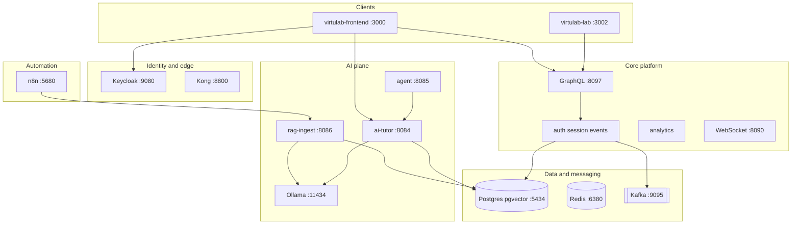

# Rag-GenAI-n8n-AgenticAI

[](https://github.com/dseevs/Rag-GenAI-n8n-AgenticAI)

**VirtuLab** — a full-stack **virtual learning platform** that brings together microservices, **RAG**, **generative AI tutoring**, **multi-agent orchestration**, **n8n workflow automation**, event streaming, SSO, and observability in one repository.

Built to explore **many real-world technologies at once** so you can see how they connect—not only tutorials in isolation.

---

## What you will learn here

| Topic | Examples in this repo |
|-------|------------------------|
| Microservices | 14 Spring Boot WebFlux services |
| Frontend | Next.js 16, React 19, Auth.js, Redux Saga |
| Security | Keycloak OIDC, JWT, Kong gateway |
| Data | PostgreSQL, **pgvector**, Redis, Flyway |
| Messaging | Kafka (Redpanda), RabbitMQ |
| GenAI | Ollama, embeddings, AI tutor |
| RAG | Markdown corpus → vector search → cited answers |
| Agents | Orchestrator calling tools and tutor APIs |
| Automation | n8n cron + webhooks |
| Ops | Prometheus, Grafana, JMeter, Docker, K8s |

**Deep dive on every technology:** **[TECHNOLOGY_STACK.md](TECHNOLOGY_STACK.md)**

---

## Documentation

| Guide | Contents |
|-------|----------|
| **[GETTING_STARTED.md](GETTING_STARTED.md)** | Install, run Path A (core) or Path B (full stack), ports, demo users, troubleshooting |
| **[TECHNOLOGY_STACK.md](TECHNOLOGY_STACK.md)** | What each tool is, why it is used, and which concepts it teaches |
| **[local-setup/README.md](local-setup/README.md)** | Private corpus, lab content, and secrets (not in Git) |
| **[GITHUB_SETUP.md](GITHUB_SETUP.md)** | Clone, SSH/PAT auth, push, security checklist |

---

## Quick start (5 commands)

```bash
git clone git@github.com:dseevs/Rag-GenAI-n8n-AgenticAI.git
cd Rag-GenAI-n8n-AgenticAI

cd virtulab-platform/deploy && docker compose up -d
cd ../.. && cd virtulab-platform && ./scripts/build.sh && ./scripts/run-all.sh
```

In another terminal:

```bash
cd virtulab-frontend && cp .env.example .env.local
# Set AUTH_SECRET: openssl rand -base64 32
npm install && npm run dev
```

Open **http://localhost:3000** → sign in as `student1` / `password`.

For AI (RAG + tutor), create a minimal corpus and follow **Path B** in [GETTING_STARTED.md](GETTING_STARTED.md).

---

## Architecture (overview)



---

## Repository layout

```
├── virtulab-platform/     # Spring microservices, Docker, n8n, MCP, ML scripts
├── virtulab-frontend/     # Next.js platform (login, dashboard, AI Studio)
├── virtulab-lab/          # Next.js virtual lab UI
├── virtulab-load-tests/   # JMeter smoke/load tests
├── local-setup/           # Instructions for gitignored private assets
├── GETTING_STARTED.md     # How to run everything
├── TECHNOLOGY_STACK.md    # Technology and concept reference
└── GITHUB_SETUP.md        # Git publish guide
```

---

## Not included in this public repo

These are **gitignored** on purpose (proprietary content, internal runbooks, secrets):

- `virtulab-platform/rag-corpus/` — RAG training markdown  
- `virtulab-lab/content/` — lab scenarios  
- `virtulab-platform/docs/` — internal phase runbooks  
- `.env.local`, production secrets  

See **[local-setup/README.md](local-setup/README.md)** for how to add them locally.

---

## Development defaults (change before production)

| System | Credentials |
|--------|-------------|
| Keycloak users | `student1`, `dev1`, `admin1` → password `password` |
| Postgres / RabbitMQ | `virtulab` / `virtulab` |
| n8n / Grafana | `admin` / `admin` |

---

## Security

- Rotate all default passwords and `JWT_SECRET` before shared deployments.  
- Never commit `.env.local` or real K8s secrets.  
- Treat AI and agent endpoints as **untrusted input** — enforce roles and validate tool calls.

---

## Author

**[dseevs](https://github.com/dseevs)** — portfolio and learning project combining RAG, GenAI, n8n, and agentic AI on a microservices education platform.

**Live repo:** https://github.com/dseevs/Rag-GenAI-n8n-AgenticAI
